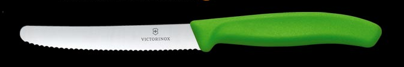
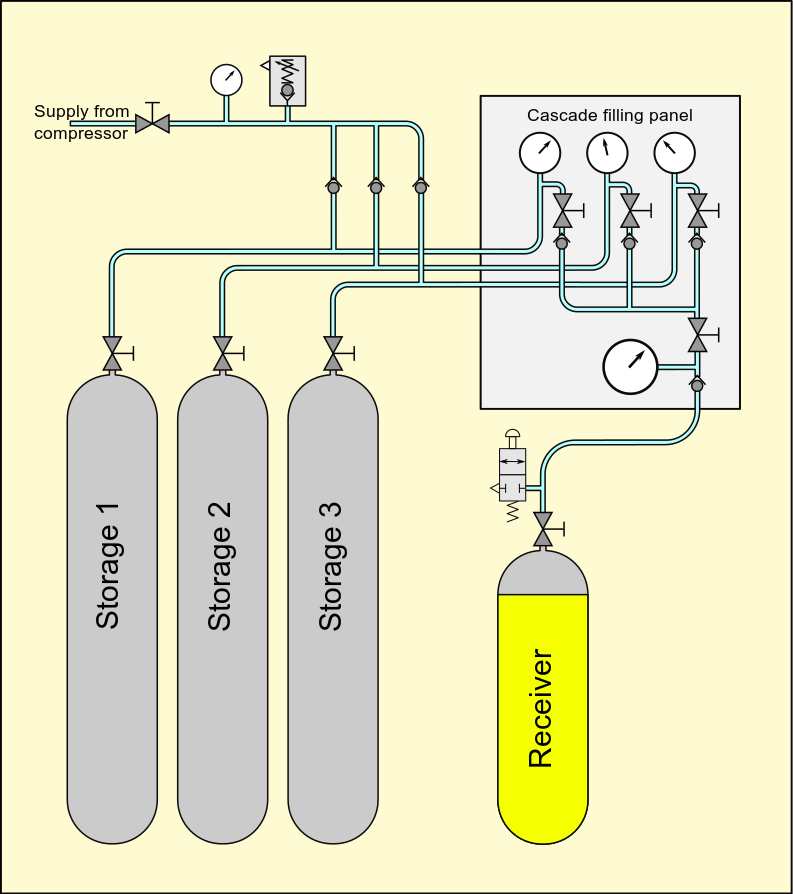
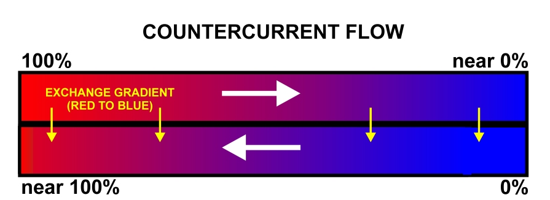

This post tries to extract a concept from a few different but related
scenarios: blunt kitchen knives, refilling oxygen cylinders, the
principle of least privilege, heat-exchangers, and corporate PC
policies.

#### Knives

*Disclaimer: I\'m no chef, so take this with a pinch of salt\... Also,
one should use sharp knives, but here I\'m talking about the very
useful, inexpensive, serrated/wavy edge
**very-difficult-to-sharpen-at-home** knives that are going to get
blunt during daily use.*

Have you ever reached for the sharpest knife in the kitchen, only to
realise that it is almost as blunt as the rest of them? This, despite
the fact that you\'ve only been using it for those delicate, precise
tasks that require the sharpest of knives (slicing soft figs). Except,
of course, that one time when you used it to clean earth clods from
carrots (it worked so well!)... and cut steak on a ceramic plate...

Fast-forward: now, there\'s no shortage of knives, but none are sharp
enough for cutting tomatoes, and all are too precious for de-husking
coconuts (those that weren\'t, have been thrown away...
So.Many.Blunt.Knives.).

The solution, of course, is to use the top ranking sharpest knives for
only those tasks that require it. Or, more generally, use the first
knife whose ranked sharpness is adequately up to the challenge. If none
are, sharpen one (or buy a new top ranking one). I.e. a wide range of
sharpnesses is desired.

#### PoLP

This sounds a little similar to the 
[*Principle of least privilege*](https://en.wikipedia.org/wiki/Principle_of_least_privilege)
(PoLP) in software engineering, in that any extra sharpness (privilege)
for the task at hand would, not only be a wasted overkill, but would
indeed be a disadvantage, as the knife would become duller quicker
performing this overly rough task and therefore less useful next time (A
too high access level isn\'t just unnecessary, it increases the risk of
inadvertently or maliciously breaking something).

#### O2

To get back to the title: How does one fill a small oxygen cylinder
(e.g. pilot\'s personal breathing O2) efficiently from larger
cylinders when they\'re all rated to the same pressure, and considered
full/delivered at the same pressure (\~2300 psi, 16 MPa). Simply,
filling a few small cylinders from a large one would at first be fine
(due to the large size difference ratio), but once the large cylinder(s)
were at, say, 90% the small one would also top out at 90% of the desired
pressure.

As with the knives scenario above, the efficiency secret is to have a
bank of large tanks *all at different pressures and to use them
judiciously*. Initially, the small cylinder is connected to (and
equalised with) the lowest pressure large tank; next, the second lowest
pressure large tank, and so on. This way, only one large tank needs to
be above the desired delivery pressure, and only a little O2 is
required to bump the small one\'s pressure up that last little notch.

The gas industry calls it a [Cascade filling system](https://en.wikipedia.org/wiki/Cascade_filling_system) and
here\'s a video of it in action: [Filling O2 Cylinders](https://www.youtube.com/watch?v=9rmh3JXj8Zw).

The above examples (knives, PoLP, and oxygen refilling) are all discrete
along one dimension: Individual knives, oxygen tanks, or access levels
(arguably).

#### Countercurrent Exchange

Along the other dimension, some are continuous (a knife\'s sharpness, a
tank\'s pressure) and the other isn\'t usually continuous (read vs. read
& write, SELECT vs INSERT), but can be (e.g. usage quotas). But there\'s
a similar mechanism in physics (and biology) that is continuous in both
dimensions: a [Countercurrent exchange](https://en.wikipedia.org/wiki/Countercurrent_exchange)

Here, instead of a sharpness delta (between the knife, and what is
required by the cutting task), or a pressure gradient (between the
small, and a few large O2 cylinders), there is a temperature (or
osmotic, or concentration) gradient.

#### Conclusion

Without going into the physics, a counter-current heat exchanger is
optimal because it maximises the temperature over the length of the
device. Or it maximises the integral of the delta.

Some more societal scenarios come to mind that have similar dynamics:

1. All things being equal, it would be a better use of Professor's time
teaching PhD students to gain that last step of
insight (before embarking on their independent research journey), rather than
helping first-year undergraduates grasp the basics (where an
alternate Junior Lecturer might suffice, or, additionally, even be
more in touch with undergraduates' needs).
  
2. A large corporation might only buy highly specced new desktop
computers, and then shift the existing ones down the corporate (or
needs-based) \"ladder\". Specifically, do not acquire yet more new
mid-range machines to go with yesteryear\'s
top-specced-now-mid-range machines. Perish the thought.

If you think they\'re indeed conceptually related, and can name
the generic concept, please let me know. 

